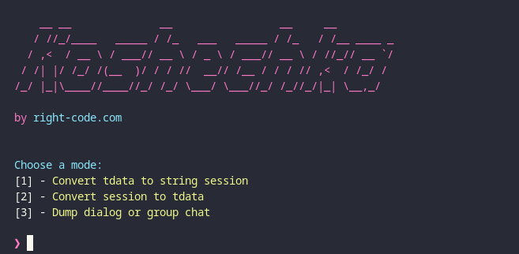

# Koshechka

This project is a Python-based tool for managing Telegram sessions and data. It provides three main functionalities:

1. Convert Telegram tdata files to string sessions.
2. Convert string sessions back to tdata.
3. Dump messages, media, and user data from Telegram chats or groups.

---

## Screenshots



---

## Features

- **Session Management**: Seamlessly convert between tdata and string session formats.
- **Data Export**: Download and export messages, photos, videos, and voice messages from Telegram dialogs or group chats.
- **User-Friendly**: Console-based interface with detailed logs.

---

## Requirements

To use this project, ensure you have the following Python dependencies installed:

- `loguru`
- `colorama`
- `telethon`
- `opentele`
- `cryptg`
- `tqdm`

You can install the required dependencies by running:
```bash
pip install -r requirements.txt
```

---

## Usage

### 1. Clone the Repository

```bash
git clone https://github.com/right-git/koshechka.git
cd koshechka
```

### 2. Set Up Configuration

Before running the project, set up your Telegram API credentials:

- `API_ID`: Obtain this from https://my.telegram.org.
- `API_HASH`: Obtain this from https://my.telegram.org.

You can provide these values in a `config.py` file:

```python
API_ID = your_api_id
API_HASH = "your_api_hash"
```

### 3. Run the Script

```bash
python main.py
```

### 4. Choose an Option

When prompted, select one of the modes:

1. Convert tdata to string session
2. Convert string session to tdata
3. Dump messages and media from a chat or group

---

## File Descriptions

- **main.py**: The entry point of the project that provides a console interface for the user.
- **converter.py**: Contains the logic for converting tdata to string sessions and vice versa.
- **tgdumper.py**: Handles the exporting of messages and media from Telegram chats or groups.

---


## Contribution

Feel free to fork the repository and submit pull requests. Suggestions and issues are welcome!

---

## Notes

- Ensure that you do not share sensitive data such as `API_ID`, `API_HASH`, or session files publicly.
- The tool is intended for ethical use only. Always respect Telegram's Terms of Service.

